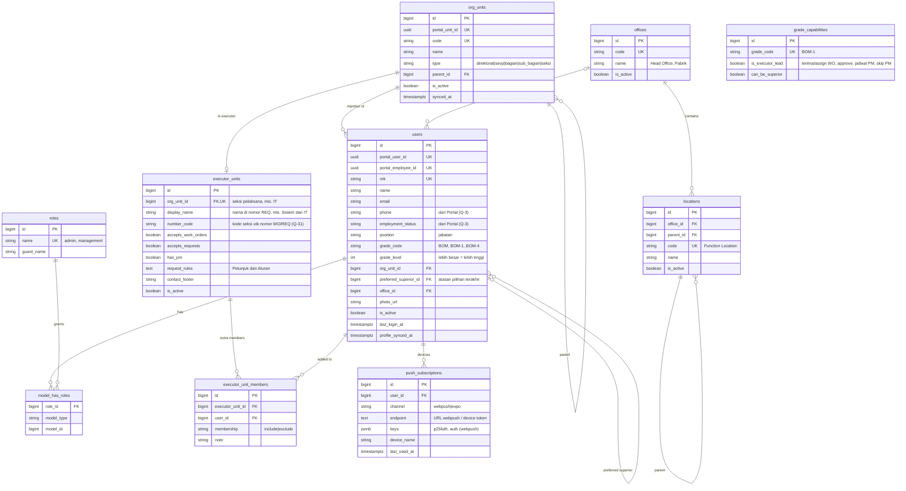
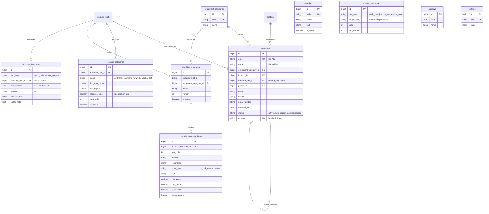
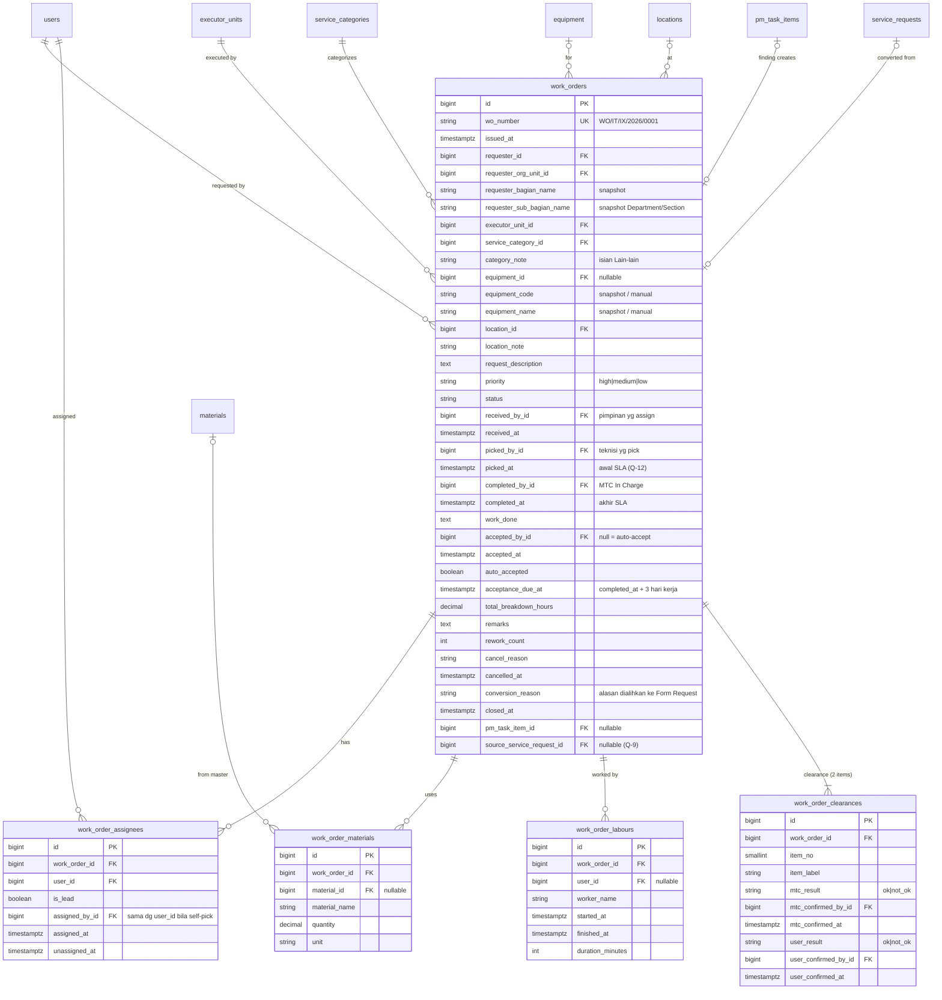
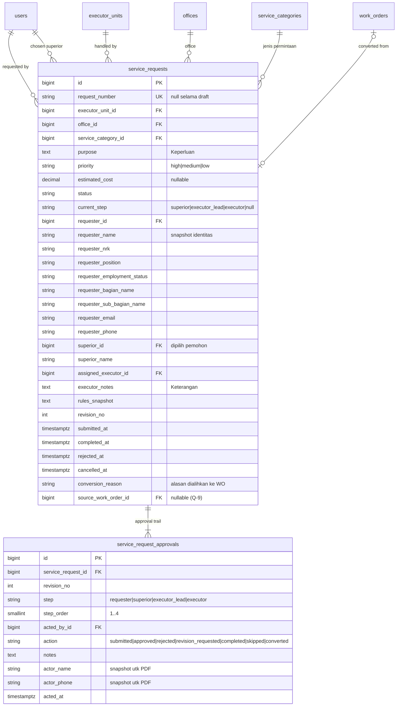
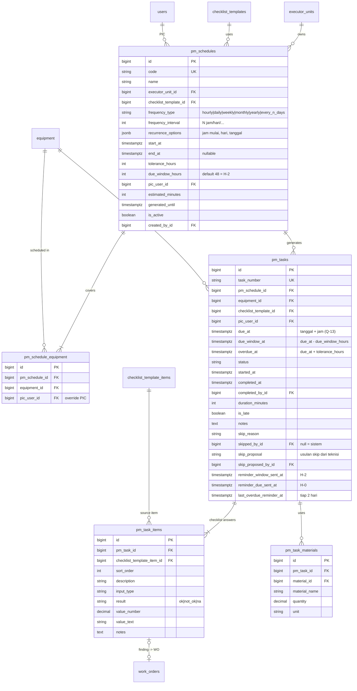
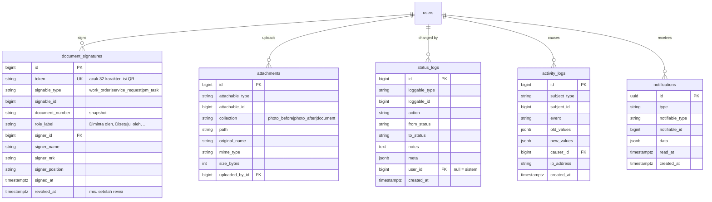

# ERD — PM-App PT INL

> Status: **DRAFT v0.3** — sudah memasukkan jawaban Q-1…Q-36 di `docs/OPEN_QUESTIONS.md`.
> Rujukan: `docs/PRD.md`, formulir di `docs/forms/`, `docs/SSO.md`. Keputusan yang masih terbuka ditandai **[Q-n]**.

## Konvensi

- Database **PostgreSQL** (Q-25). Nama tabel/kolom/kode: Inggris `snake_case`. Label UI: Indonesia.
- PK `id` = `BIGINT GENERATED ALWAYS AS IDENTITY`. ID dari Portal (UUID) disimpan di kolom `portal_*_id`.
- Semua tabel punya `created_at`, `updated_at`; master + transaksi utama pakai `deleted_at` (soft delete).
- Status disimpan sebagai **kode Inggris** (PHP backed enum), dipetakan ke label Indonesia di UI (`docs/STATE_MACHINES.md`).
- Data identitas yang dicetak di formulir **di-snapshot** ke dokumen saat diajukan/disetujui.
- Timestamp `TIMESTAMPTZ`, aplikasi berjalan di `Asia/Jakarta`.
- Tabel standar framework (`jobs`, `failed_jobs`, `cache`, `sessions`, tabel internal spatie) tidak digambar.

## Ringkasan domain

| Domain | Tabel |
|---|---|
| Identitas & akses | `users`, `roles`, `model_has_roles`, `grade_capabilities`, `push_subscriptions` |
| Organisasi | `org_units`, `offices`, `locations`, `executor_units`, `executor_unit_members` |
| Master teknis | `equipment_categories`, `equipment`, `materials`, `service_categories`, `checklist_templates`, `checklist_template_items` |
| Konfigurasi | `document_templates`, `number_sequences`, `holidays`, `settings` |
| Work Order | `work_orders`, `work_order_assignees`, `work_order_materials`, `work_order_labours`, `work_order_clearances` |
| Form Request | `service_requests`, `service_request_approvals` |
| Preventive Maintenance | `pm_schedules`, `pm_schedule_equipment`, `pm_tasks`, `pm_task_items`, `pm_task_materials` |
| Lintas modul | `document_signatures`, `attachments`, `status_logs`, `activity_logs`, `notifications` |

### Perubahan utama dari v0.1

| Keputusan | Dampak ke skema |
|---|---|
| Q-1/Q-8/Q-17: pemohon **memilih atasannya sendiri** (user dengan grade lebih tinggi) | `users.superior_id` dihapus → `users.preferred_superior_id` (pilihan terakhir, hanya default). `service_requests.superior_id` dipilih per dokumen. Aturan bypass dihapus. |
| Q-2: pakai **Bagian / Sub Bagian** | snapshot `requester_bagian_name`, `requester_sub_bagian_name` (bukan divisi/departemen) |
| Q-6/Q-20/Q-31: pelaksana = **seksi** (unit Portal); nomor WO **dan** REQ pakai **kode seksi** | `service_divisions` → `executor_units` (terikat `org_units`); `number_sequences.scope_code` = kode seksi |
| Q-16/Q-36: kewenangan dari **grade Portal**; pimpinan pelaksana = grade **satu tingkat di atas** teknisi | `users.grade_*`, tabel `grade_capabilities`; `member_role` dihapus |
| Q-20: kategori dikelola tiap seksi, dipakai WO **dan** Form Request | `work_categories` + `request_types` digabung → `service_categories` |
| Q-9: konversi WO ↔ Form Request | `work_orders.source_service_request_id`, `service_requests.source_work_order_id`, status `converted` |
| Q-22: tanda tangan = **QR code** yang bisa diverifikasi | tabel `document_signatures` |
| Q-10: auto-accept setelah 3 **hari kerja** | tabel `holidays` + setting hari kerja |
| Q-13/Q-14/Q-24: jatuh tempo pakai **tanggal + jam**, jadwal **per N jam** | `pm_tasks.due_at`, `pm_schedules.frequency_type = hourly`, toleransi dalam jam |
| Q-26: push notification + alarm mobile | tabel `push_subscriptions` |

---

## 1. Identitas, akses & organisasi

**Aturan turunan (bukan kolom)**
- **Bagian / Sub Bagian pemohon** = ancestor `org_units` bertipe `bagian` / `sub_bagian` dari `users.org_unit_id`.
- **Staf pelaksana** suatu `executor_unit` = user aktif di `org_unit` seksi tsb **atau turunannya**, ditambah
  `executor_unit_members.membership = include` (mis. Kabag/Kasubag yang unitnya di atas seksi), dikurangi `exclude`.
- **Teknisi** = staf pelaksana dengan grade terendah di seksi itu (umumnya BOM-4).
  **Pimpinan pelaksana** (Q-36) = staf pelaksana dengan grade **satu tingkat di atas** teknisi (umumnya BOM-3/Supervisor);
  bila tidak ada, naik ke tingkat berikutnya (BOM-2, BOM-1). Pimpinan menerima/assign WO (teknisi dinotifikasi),
  approve Form Request tahap pelaksana, membuat jadwal PM, dan skip tugas PM. Urutan tingkat diatur di `grade_capabilities`.
- **Kandidat atasan** (dropdown) = user aktif dengan `grade_level` > `grade_level` pemohon. Default terisi
  `preferred_superior_id`. Pemohon dengan grade tertinggi (tidak ada kandidat) → step atasan dilewati otomatis.
- Role global spatie tinggal `admin` dan `management` (dashboard global, Q-21). Semua user login = pemohon.

---

## 2. Master teknis & konfigurasi

**Catatan**
- `number_sequences`: unique (`doc_type`, `scope_code`, `year`), diambil dengan `SELECT … FOR UPDATE`. Reset per tahun.
  Urutan nomor per seksi pelaksana per tahun (`scope_code` = kode seksi, Q-31).
  - WO: `WO/{kode seksi}/{bulan romawi}/{tahun}/{0001}`.
  - Request: `REQ{0001}/{kode seksi}/{bulan romawi}/{tahun}`, diterbitkan saat submit pertama (Q-7).
- `service_categories` dikelola pimpinan pelaksana masing-masing seksi (Q-20). Saat membuat WO/Request,
  pemohon memilih seksi pelaksana → dropdown kategori difilter `executor_unit_id` + `for_work_order`/`for_request`.
- `holidays` + setting `working_days` (default Senin–Jumat) dipakai untuk menghitung "3 hari kerja" auto-accept (Q-10).
- `checklist_templates` di-versi; butir di-snapshot ke `pm_task_items`.
- Import Excel (Q-27): `locations`, `equipment`, `materials`, `checklist_templates` + item.

---

## 3. Work Order (FM-BOPS-10/05)

**Catatan**
- **SLA (Q-12)** = `completed_at − picked_at` (dari teknisi mengambil/mulai mengerjakan sampai selesai). Bila ada rework,
  SLA dihitung dari `picked_at` pertama sampai `completed_at` terakhir; `rework_count` dilaporkan terpisah.
  Waktu tunggu (`picked_at − issued_at`) tetap ditampilkan sebagai metrik pendukung.
- **Penerima hasil (Q-10)**: pemohon, `preferred_superior_id` pemohon, atau user aktif di `requester_org_unit_id` yang sama.
- Indeks: `(executor_unit_id, status)`, `(requester_id, status)`, `(requester_org_unit_id)`, `(equipment_id, issued_at)`,
  partial index `(acceptance_due_at) WHERE status = 'completed'` untuk job auto-accept.

---

## 4. Form Request (INLHO/BSIS-ITC/F-004)

**Catatan**
- Atasan dipilih pemohon dari kandidat grade lebih tinggi; selama `waiting_superior` pemohon boleh **mengganti atasan**
  (pengganti delegasi, Q-17) — tercatat di `status_logs`.
- Tidak ada step biaya tambahan (Q-18); Keperluan berupa teks (Q-19).
- Blok PENGESAHAN = baris approval `revision_no` terakhir + QR dari `document_signatures`.

---

## 5. Preventive Maintenance

**Catatan**
- Satu tugas per equipment per kejadian (Q-14). Unique `(pm_schedule_id, equipment_id, due_at)` → generator idempotent.
- Frekuensi `hourly` = tugas berulang tiap N jam (mis. tiap 8 jam, Q-14). Untuk jadwal per jam, `due_window_hours`
  otomatis dibatasi maks. setengah interval (agar H-2 tidak tumpang tindih dengan kejadian berikutnya), dan horizon
  generate lebih pendek (7 hari) dibanding jadwal harian ke atas (60 hari, Q-15).
- Jadwal berbasis jam = kalender tiap N jam (Q-32 = a); running hours mesin tidak dimodelkan.
- Log maintenance per equipment = gabungan `pm_tasks` + `work_orders` berdasarkan `equipment_id`.

---

## 6. Lintas modul: tanda tangan QR, lampiran, audit, notifikasi

**Catatan**
- **QR tanda tangan (Q-22)**: setiap pengesahan (Diminta, Diterima/Disetujui, Diselesaikan, Diterima user) membuat satu
  `document_signatures`. PDF mencetak QR berisi `{FE_URL}/verifikasi/{token}`. Halaman publik itu (tanpa login) menampilkan
  nama penanda tangan, jabatan, waktu, nomor dokumen, dan status dokumen saat ini. Token acak (bukan ID berurutan) agar
  tidak bisa ditebak; tanda tangan yang dibatalkan (revisi) tampil "tidak berlaku".
- Lampiran (Q-29): maks 10 file × 5 MB per dokumen, foto dikompres di klien, disimpan di volume Docker.
- Material hanya dicatat, tidak memotong stok (Q-30).
- Relasi polimorfik memakai `morphMap` alias pendek (`work_order`, `service_request`, `pm_task`).
