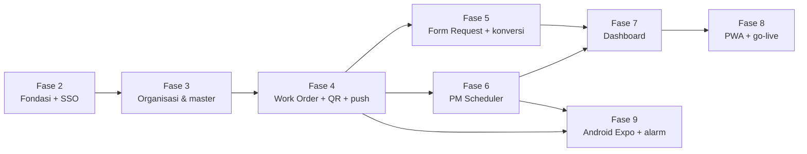

# Rencana Implementasi — PM-App PT INL

> Status: **v0.3** — sudah memasukkan jawaban `docs/OPEN_QUESTIONS.md`.
> Fase 1 = analisis & desain (`PRD.md`, `ERD.md`, `API.md`, `STATE_MACHINES.md`, `SSO.md`, `OPEN_QUESTIONS.md`).
> Estimasi = file **baru** yang ditulis tangan (tanpa hasil scaffold). BE = `be/` (Laravel 11, PostgreSQL), FE = `fe/` (Next.js 14).
> Setiap fase selesai bila: `php artisan test` hijau, `npm run lint` bersih, demo ke user, dokumen diperbarui.

## Ringkasan

| Fase | Tujuan | Masih menunggu | BE | FE | Total ±file |
|---|---|---|---|---|---|
| 2 | Fondasi, Docker, SSO web (pola IDAS), endpoint exchange mobile, sinkron Portal, audit | — | ~50 | ~30 | **~80** |
| 3 | Organisasi pelaksana & master data + import Excel | — | ~95 | ~50 | **~145** |
| 4 | Work Order + QR tanda tangan + notifikasi in-app, Web Push & Expo Push | — | ~75 | ~35 | **~110** |
| 5 | Form Request + PDF + konversi WO ↔ Request | — | ~45 | ~22 | **~67** |
| 6 | PM Scheduler (termasuk per N jam) | — | ~65 | ~32 | **~97** |
| 7 | Dashboard (SLA pick→selesai), laporan, export | — | ~25 | ~25 | **~50** |
| 8 | PWA, hardening, UAT, go-live web | — | ~15 | ~20 | **~35** |
| 9 | Aplikasi Android React Native (Expo) + alarm | — | ~5 | ~60 (mobile) | **~65** |
| | | | **~375** | **~274** | **~650** |

Fase 9 dapat dimulai paralel setelah fase 4 (API WO stabil), lalu menyusul modul Request & PM.

---

## Fase 2 — Fondasi (±80 file)

**Backend (±50)**
- Infra: `docker-compose.yml` (pm-be, pm-fe, pm-db **PostgreSQL**, pm-redis, pm-worker, pm-scheduler), Dockerfile ×2, `.env.example` ×2.
- Config: `config/portal.php`, session/sanctum/cors (cookie `pm_app_session`, stateful domains), timezone.
- Migrations: `users` (tanpa password, dengan grade & `preferred_superior_id`), `org_units`, `offices`, `status_logs`,
  `activity_logs`, `settings` (+ sanctum, spatie).
- Services: `Portal/PortalClient` (verify, employees, org units — TLS terverifikasi), `Auth/SsoLoginService`
  (dipakai web `/auth/sso` dan mobile `/auth/mobile/exchange`), `Sync/EmployeeSyncService`, `Audit/StatusLogger`, `Numbering/NumberSequenceService`,
  `Org/OrgHierarchy` (bagian/sub bagian dari ancestor).
- `AuthController` (`/auth/sso`, `/auth/mobile/exchange`, `/auth/logout`, `/auth/me`), `UserController` (`superior-candidates`, sync).
- Command `portal:sync-employees`; seeder role & setting.
- Tests: SSO sukses/token invalid/expired/user nonaktif/tanpa employee (`Http::fake`), exchange mobile (token 30 hari, satu per perangkat),
  kandidat atasan hanya grade lebih tinggi, sinkronisasi, logout web & mobile.

**Frontend (±30)**
- Tailwind + shadcn/ui, `lib/api.ts` (credentials include + XSRF), `lib/csrf.ts`, React Query, `middleware.ts`
  (`?token` → `/sso/verify`, guard cookie sesi).
- Halaman `/sso/verify`, `/logout`, `/akses-ditolak`, layout (sidebar sesuai peran), `/profil`.
- Komponen umum: `DataTable`, `PageHeader`, `StatusBadge`, `ConfirmDialog`, `FormField`, `EmptyState`, `UserPicker` (searchable).

**Di luar repo ini:** commit patch Portal (`docs/SSO.md` §7, sudah diterapkan), registrasi PM-App di tabel `aplikasi` Portal.

## Fase 3 — Organisasi pelaksana & master data (±145 file)

- **BE (±95):** `executor_units` + staf efektif (otomatis dari subtree seksi + include/exclude) + `grade_capabilities`;
  `service_categories` per seksi; `locations`, `equipment_categories`, `equipment` (+QR label), `materials`,
  `checklist_templates` (+ item, versioning), `document_templates`, `holidays`; `attachments` + `AttachmentService`
  (10 × 5 MB); import Excel lokasi/equipment/material/checklist (`maatwebsite/excel`) + export; Policy berbasis
  pimpinan/teknisi; tests per master + tes staf efektif & pemetaan grade.
- **FE (±50):** halaman admin & pimpinan untuk tiap master, pohon lokasi, editor butir checklist, dialog import Excel
  (template unduhan + laporan baris gagal), pengelola kategori per seksi, `EntityPicker`, `FileUploader` (kompres di klien).

## Fase 4 — Work Order (±110 file)

- **BE (±75):** 5 migration WO; `WorkOrderService` (create, cancel, pick, receive, start, complete, accept, auto_accept,
  convert_to_request*) + state machine; `WorkOrderNumberGenerator` (kode sub bagian); `WorkingDayCalculator` (libur + hari kerja);
  command `wo:auto-accept`; **`document_signatures`** + `SignatureService` + endpoint publik verifikasi QR;
  **notifikasi**: tabel `notifications`, `push_subscriptions`, channel Web Push (`laravel-notification-channels/webpush`,
  VAPID), 6 Notification class WO; PDF FM-BOPS-10/05 (Blade + QR); export.
  (*konversi diselesaikan di fase 5 saat modul Request ada.)
- **Tests (±14):** semua transisi valid/invalid, pick vs assign, rework, auto-accept melewati akhir pekan & libur,
  penerima seunit/atasan, nomor paralel, QR valid/dicabut, SLA.
- **FE (±35):** list WO (tab Saya / Unit saya / Pool / Ditugaskan), form WO (seksi → kategori, foto kamera), detail + timeline,
  panel aksi per status & peran, form selesai, form penerimaan, bell + halaman notifikasi, izin push di browser,
  halaman publik `/verifikasi/[token]`.

## Fase 5 — Form Request (±67 file)

- **BE (±45):** migrations (2), `ServiceRequestService` (submit + pilih atasan, change_superior, approve, reject,
  request_revision, assign, complete, cancel, convert_to_work_order) + state machine; konversi dua arah dengan WO;
  `ServiceRequestNumberGenerator` **[Q-31]**; PDF INLHO/BSIS-ITC/F-004 dengan QR di blok PENGESAHAN; notifikasi; export.
- **Tests (±12):** alur 4 tahap, kandidat atasan, ganti atasan, revisi mengulang & mencabut QR, konversi dua arah,
  snapshot identitas, batal sebelum diproses.
- **FE (±22):** form request (identitas read-only, dropdown atasan searchable), antrian "Perlu persetujuan saya",
  detail + blok PENGESAHAN, dialog konversi, pratinjau/unduh PDF, editor Petunjuk & Aturan.

## Fase 6 — PM Scheduler (±97 file)

- **BE (±65):** 5 migration; `RecurrenceCalculator` (per N jam, harian, mingguan, bulanan, tahunan, setiap N hari;
  akhir bulan, kabisat) — unit test terpadat; `PmTaskGenerator` (idempotent, horizon 7/60 hari); `PmStatusRefresher`
  (H-2, H-0, overdue + pengingat 2 hari, auto-skip); `PmTaskService` (start, items, complete, propose_skip, skip, reassign,
  buat WO dari temuan); commands `pm:generate-tasks` (tiap jam) & `pm:refresh-statuses` (15 menit); `EquipmentHistoryService`;
  notifikasi (H-2, H-0, overdue, usulan skip); export.
- **Tests (±16):** tabel kasus kalkulasi, idempotensi, transisi berbasis waktu (`travelTo`), auto-skip, pengingat tidak dobel,
  hanya pimpinan bisa skip.
- **FE (±32):** form jadwal + pratinjau, kalender bulan/minggu (tugas + proyeksi), "Tugas saya" mobile, layar checklist
  (tombol besar, foto per butir, auto-save), riwayat equipment, scan QR equipment.

## Fase 7 — Dashboard & laporan (±50 file)

- **BE (±25):** `DashboardService` (agregat terindeks, cache 5 menit), 7 endpoint, 4 export, tests angka KPI.
- **FE (±25):** dashboard per seksi & global: KPI, status WO, SLA pick→selesai per prioritas & teknisi, kepatuhan PM,
  top 10 equipment, breakdown hours, beban teknisi; filter & export.

## Fase 8 — PWA, hardening, go-live (±35 file)

- **PWA:** manifest, ikon, service worker (Web Push + cache aset/halaman tugas), prompt "Add to Home Screen" (wajib untuk push di iOS).
- **Hardening:** rate limit, header keamanan, tes akses lintas seksi, backup PostgreSQL terjadwal, `/health`, pruning token/notifikasi.
- **Go-live:** impor data awal produksi (Excel), UAT per peran (pemohon, atasan, pimpinan, teknisi, admin), panduan pengguna, `docs/DEPLOY.md`.

## Fase 9 — Android React Native / Expo (±65 file, folder `mobile/`)

- Login: form email + password → Portal `/api/auth/login` (+ langkah TOTP) → `/api/sso/token` → PM-App `/auth/mobile/exchange`;
  token di `expo-secure-store` (`docs/SSO.md` §5b). Tanpa passkey.
- Layar: inbox "perlu tindakan", pool & detail WO (pick, kerjakan, selesai dengan foto kamera), tugas PM (checklist offline-first,
  sinkron saat online), approval Form Request, scan QR equipment, notifikasi.
- **Push & alarm** (`expo-notifications`, Expo Push API dari BE): channel Android `alarm` (importance MAX, suara alarm kustom,
  bypass DND bila diizinkan, full-screen intent) untuk:
  - WO prioritas **Tinggi** baru masuk pool / di-assign ke saya;
  - jadwal PM **mendekati waktu** (H-2 & H-0) dan PM **overdue**;
  - Form Request menunggu approval saya **> 1 hari**;
  - WO saya **ditolak user** (acceptance = No, harus dikerjakan ulang);
  - WO prioritas Tinggi belum di-pick > 30 menit (eskalasi ke pimpinan).
  Event lain memakai channel `default` (bunyi biasa). Pengguna bisa mematikan alarm per event di pengaturan.
- Build: EAS Build (APK/AAB internal), update OTA via EAS Update.

## Urutan & ketergantungan

