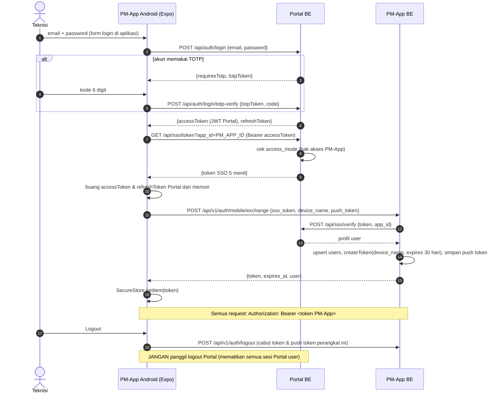

# SSO & Autentikasi — PM-App PT INL

> Status: **v0.3** (5 Okt 2026). Hasil penelusuran kode Portal INTES (`../Intes/portal-app-be`, `../Intes/portal-fe`)
> dan aplikasi IDAS/Approver yang sudah terhubung. Rujukan baris kode = kondisi repo Portal per tanggal tersebut
> (setelah patch §7). PM-App **tidak menyimpan password**.

## Ringkasan

| Pertanyaan | Jawaban singkat |
|---|---|
| Mekanisme Portal | **Bukan OAuth2/OIDC.** Portal memakai **JWT buatan sendiri** (`@fastify/jwt`, HS256) untuk sesinya sendiri, dan untuk aplikasi lain memakai **redirect dengan token sekali pakai di URL** (`?token=…&appId=…`) yang diverifikasi server-ke-server. Tidak ada shared cookie lintas domain. |
| Pendaftaran aplikasi | Baris di tabel `aplikasi` (nama, URL, `auth_mode = sso`, `access_mode`). **Tidak ada client_id/secret maupun callback URL terpisah**; `app_id` (UUID) bersifat publik, `aplikasi.url` = tujuan redirect. |
| Data user | `POST /api/sso/verify` → NRK, nama, email, jabatan, grade, unit + hierarki (bagian/sub bagian/seksi), atasan, foto, area penempatan, **no HP & status karyawan (baru)**. |
| Single logout | **Tidak ada.** Logout Portal hanya mematikan sesi Portal. |
| Hak akses per aplikasi | **Ada**, dicek saat token SSO dibuat (`access_mode`: semua / kecuali / khusus / per unit). |
| Rekomendasi web | Pola IDAS: BE PM-App menukar token SSO → sesi cookie Sanctum SPA. |
| Rekomendasi mobile | Authorization Code + PKCE **tidak bisa** (Portal bukan OAuth2). Pakai login di aplikasi → **langsung ke API Portal dari HP** → token SSO → ditukar ke token Sanctum PM-App. |
| Perubahan Portal | Hanya patch additive no HP + status karyawan (**sudah diterapkan**, §7). Rekomendasi keamanan lain dicatat di §8 dan **tidak** diterapkan. |

---

## 1. Mekanisme autentikasi Portal

### 1a. Sesi Portal sendiri — JWT + refresh token

| Bukti | Lokasi |
|---|---|
| Plugin JWT `@fastify/jwt`, satu `JWT_SECRET` simetris, `expiresIn` dari env | `portal-app-be/src/plugins/jwt.ts:7-11` |
| `JWT_SECRET` (min 32), `JWT_EXPIRES_IN` (default 15m, `.env.example` 8h), `REFRESH_TOKEN_EXPIRES_IN` 7d, `SSO_TOKEN_EXPIRES_IN` 5m | `src/config/env.ts:21-29`, `.env.example:15,18` |
| Login email + password (bcrypt) → access JWT `{sub, email, role, tokenVersion}` + refresh token (hash di DB) | `src/services/auth.service.ts:40-98`, route `src/routes/auth.route.ts:57-64` |
| Bila TOTP aktif, login mengembalikan `{ requiresTotp, totpToken }` → lanjut `POST /api/auth/login/totp-verify` | `auth.service.ts:53-62`, `auth.route.ts:67-76` |
| Token juga diset sebagai cookie `inl_access_token` / `inl_refresh_token` — httpOnly, SameSite=Lax, **tanpa atribut `Domain`** (host-only, tidak bisa dibaca subdomain lain) | `src/utils/cookie.ts:4-5,20-34,58` |
| Verifikasi: Bearer header atau cookie → `jwtVerify()` → cek `tokenVersion` & `isActive` di DB; token ber-`purpose` ditolak | `src/plugins/auth.ts:16-64` |
| Logout: `tokenVersion + 1` dan cabut **semua** refresh token user → semua sesi Portal user itu mati | `auth.service.ts:167-175`, `auth.route.ts:90-96` |
| Passkey (WebAuthn) juga tersedia untuk login web Portal | `auth.route.ts:130-190` |
| Rate limit in-memory: `/api/auth/login`, `/login/totp-verify`, `/refresh`, dll **20 req/menit per IP**; lainnya 600 | `src/server.ts:67-83, 100-111` |
| `trustProxy: true` → IP diambil dari `X-Forwarded-For` | `src/server.ts:41` |

Kesimpulan: **tidak ada** OAuth2/OIDC, Passport, Keycloak, `client_id`, `code_challenge`, maupun endpoint `/authorize`,
`/token`, `/userinfo`, `/.well-known/openid-configuration` (grep `oauth|oidc|passport|keycloak|pkce|client_id` = 0 hasil).

### 1b. SSO ke aplikasi lain — redirect dengan token sekali pakai

| Langkah | Lokasi |
|---|---|
| User (sudah login Portal) membuka `/launch?app_id=…` di Portal FE; FE memanggil `GET /api/sso/token?app_id=` | `portal-fe/app/launch/page.tsx:67` |
| BE: cek aplikasi aktif & `auth_mode = 'sso'`, user aktif & terhubung ke karyawan, cek `access_mode` | `portal-app-be/src/services/sso.service.ts:24-101` |
| Token acak 32 byte, disimpan **hash SHA-256**, berlaku 5 menit, dikembalikan bersama `redirectUrl = aplikasi.url` | `sso.service.ts:103-137` |
| FE redirect ke `{aplikasi.url}?token=…&appId=…` | `portal-fe/app/launch/page.tsx:68-72` |
| Aplikasi klien (server) memanggil `POST /api/sso/verify {token, app_id}` — **tanpa autentikasi klien** | `src/routes/sso.route.ts:40-44` |
| Token diklaim atomik (`UPDATE … SET is_revoked = true … RETURNING`) → sekali pakai; cek kedaluwarsa | `sso.service.ts:145-164` |
| Bila `app_id` di request ≠ app tujuan token: **hanya warning**, tetap diproses | `sso.service.ts:166-168` |
| Endpoint internal `GET /api/sso/employees`, `/grades`, `/organization-units`, `/placements` dengan header `x-internal` = satu shared secret global `SSO_INTERNAL_TOKEN` | `sso.route.ts:46-140`, `env.ts:29` |

## 2. Cara aplikasi lain terdaftar & login

- **Registri**: tabel `aplikasi` (`src/db/schema/auth.ts:46-60`) — `id` UUID, `nama`, `url`, `auth_mode`
  (`sso`|`independent`, `:16`), `access_mode` (`all_employees`|`all_except`|`specific_only`|`by_unit`, `:23`),
  `target_unit_ids`, `icon`, `kategori`, `is_active`. Daftar user khusus di `app_user_access` (`:64-70`).
  Token SSO di `sso_token` (`:87-95`). Dikelola admin via `/api/apps` (`src/routes/aplikasi.route.ts:30-109`).
- **Tidak ada** `client_id`/`client_secret`, daftar callback URL, atau scope. Callback = `aplikasi.url` (satu URL per aplikasi).
  Siapa pun yang memegang token SSO bisa menukarnya di `/api/sso/verify`; keamanannya bergantung pada token acak, umur 5 menit, dan sekali pakai.
- **Contoh nyata — IDAS/Approver** (Laravel 8 + Next.js 14):
  FE `src/middleware.ts` meneruskan `?token` ke `/sso/verify` → FE ambil `/sanctum/csrf-cookie` → `POST /api/auth/login {ssoToken, appId}`
  → BE `AuthController::login` memanggil Portal `/api/sso/verify` → upsert `users` → `Auth::guard('web')->login()` (sesi cookie
  Sanctum SPA, 120 menit). Logout lokal lalu redirect ke URL Portal. **MeeTrip** memakai pola serupa di BE Fastify.

## 3. Data user yang tersedia

Sumber: payload `POST /api/sso/verify` (`sso.service.ts:269-321`). Tidak ada endpoint `userinfo` maupun klaim di token;
satu-satunya cara mengambil profil adalah verify (sekali per login) dan endpoint internal `x-internal`.

| Kebutuhan PRD | Field payload | Tersedia |
|---|---|---|
| NRK | `employee.nrk` | ✅ |
| Nama | `employee.namaLengkap` (`nama`) | ✅ |
| Email | `email` (email akun Portal) | ✅ |
| Divisi / Departemen → **Bagian / Sub Bagian** | `employee.unit` `{id, kode, nama, tipe, parentId, path, hierarchy[]}` — ambil node bertipe `bagian`/`sub_bagian`/`seksi` dari `hierarchy` | ✅ |
| Jabatan | `employee.jabatan` | ✅ |
| Grade | `employee.grade` `{id, kode (BOM-1..4), label, level}` | ✅ |
| Atasan | `employee.atasan` `{id, nrk, nama, jabatan, nomorHp}` (dari `employee.atasan_id` Portal) | ✅ |
| Foto | `employee.fotoProfil` (URL absolut) | ✅ |
| No HP | `employee.nomorHp` | ✅ *(patch §7)* |
| Status karyawan | `employee.statusKaryawan` `{id, kode, label}` | ✅ *(patch §7)* |
| Lain | `id` (user), `role` Portal, `isActive`, `employee.id`, `jenisKelamin`, `tanggalMasuk`, `penempatanArea` | ✅ |

Daftar karyawan untuk dropdown/sinkronisasi: `GET /api/sso/employees` (`x-internal`) → `id` (user Portal), `employeeId`,
`namaLengkap`, `jabatan`, `gradeLevel`, `gradeKode`, `unitNama`, `unitTipe`, `penempatan*`, `atasanId`, **`nomorHp`,
`statusKaryawanKode`, `statusKaryawanLabel` (baru)**. Filter `?aboveGradeLevel=` cocok untuk dropdown atasan.
Batasan: maksimal **500 baris** dan hanya karyawan yang sudah punya akun Portal; tidak ada NRK/email/ID unit di endpoint
ini → PM-App melengkapinya dari data verify saat user login.

## 4. Single logout & hak akses per aplikasi

- **Single logout: tidak didukung.** Tidak ada endpoint/URL logout untuk klien, tidak ada back-channel, dan JWT Portal tidak
  diketahui aplikasi klien. Logout PM-App = hapus sesi lokal lalu redirect ke Portal; sesi Portal tetap hidup.
  ⚠️ PM-App **tidak boleh** memanggil `POST /api/auth/logout` Portal, karena itu mematikan **semua** sesi Portal user
  (web & perangkat lain) lewat `tokenVersion`.
- **Hak akses per aplikasi: didukung, hanya saat token dibuat** (`sso.service.ts:62-101`):
  `all_employees` (semua user yang terhubung ke karyawan), `all_except` (blacklist `app_user_access`), `specific_only`
  (whitelist), `by_unit` (`target_unit_ids`). `super_admin` Portal bypass. Akses **tidak** dicek ulang setelah itu, jadi
  pencabutan akses di Portal baru berlaku saat user login ulang ke PM-App → sesi PM-App dibuat pendek (web) dan
  sinkronisasi harian menonaktifkan user yang tidak aktif.
- Role/permission di dalam aplikasi **tidak** disediakan Portal (hanya `user`/`super_admin` milik Portal). PM-App mengatur
  perannya sendiri dari grade + unit (lihat `docs/ERD.md`).

---

## 5. Rekomendasi integrasi

### 5a. Web (Next.js) — pola IDAS, sesi cookie Sanctum SPA

```mermaid
sequenceDiagram
    autonumber
    actor U as User (browser)
    participant PF as Portal FE
    participant PB as Portal BE
    participant FE as PM-App FE (Next.js)
    participant BE as PM-App BE (Laravel)
    U->>PF: klik ikon PM-App (/launch?app_id=PM_APP_ID)
    PF->>PB: GET /api/sso/token?app_id (cookie/JWT Portal)
    PB->>PB: cek auth_mode, user aktif, access_mode
    PB-->>PF: {token, redirectUrl}
    PF-->>U: 302 → https://pm.inl.co.id/?token=…&appId=…
    U->>FE: GET /?token=…
    FE->>FE: middleware → /sso/verify (query dipertahankan)
    FE->>BE: GET /sanctum/csrf-cookie
    FE->>BE: POST /api/v1/auth/sso {token, app_id} + X-XSRF-TOKEN
    BE->>PB: POST /api/sso/verify {token, app_id} (TLS terverifikasi)
    PB-->>BE: profil user + employee
    BE->>BE: tolak bila employee null / nonaktif; upsert users & org_units
    BE->>BE: Auth::guard('web')->login(), session()->regenerate()
    BE-->>FE: 204 + Set-Cookie pm_app_session (httpOnly)
    FE->>FE: history.replaceState (hapus ?token dari URL) → /dashboard
    Note over FE,BE: Sesi 120 menit sliding. 401 → redirect ke Portal /launch?app_id=PM_APP_ID
    U->>FE: Logout
    FE->>BE: POST /api/v1/auth/logout + X-XSRF-TOKEN
    BE-->>FE: 204 (sesi dihapus)
    FE-->>U: redirect ke beranda Portal (sesi Portal tetap)
```

Catatan: FE & BE di satu origin (Next.js mem-proxy `/api` dan `/sanctum` ke Laravel), sehingga cookie first-party dan
CORS tidak diperlukan. Token SSO dihapus dari URL segera setelah ditukar agar tidak tersimpan di history/log.

### 5b. Mobile Android (React Native / Expo) — login di aplikasi, langsung ke Portal

**Kenapa bukan Authorization Code + PKCE:** Portal tidak punya endpoint `/authorize` & `/token`, `client_id`, maupun
callback per klien (§1–2). Membuat server OAuth2 di Portal melanggar batasan "jangan ubah Portal". Alur di bawah memberi
sifat yang mirip: aplikasi tidak pernah menyimpan password, kredensial hanya dikirim ke Portal, dan yang ditukar ke PM-App
hanya token sekali pakai berumur 5 menit (setara authorization code).

**Revisi dari rancangan v0.2 (Q-33):** login dikirim **langsung dari HP ke Portal**, bukan diteruskan oleh BE PM-App, karena:
1. rate limit login Portal 20/menit **per IP** — jika semua login lewat server PM-App, satu IP itu akan terkena 429 saat pergantian shift;
2. password tidak pernah melewati server PM-App;
3. TOTP Portal bisa ditangani langsung oleh aplikasi.



Detail:
- Login Portal hanya menerima **email** (`validators/auth.validator.ts:4-7`), bukan NRK. Passkey tidak dipakai di mobile (Q-33).
- Token Portal hanya ada di memori beberapa detik dan **tidak disimpan**. Refresh token Portal yang ikut terbit tidak dipakai
  dan kedaluwarsa sendiri (7 hari).
- Token PM-App: Sanctum personal access token, 30 hari, satu per perangkat, dicabut saat logout/user nonaktif.
  Saat kedaluwarsa (401), aplikasi kembali ke layar login.
- HP harus bisa menjangkau Portal BE (`PORTAL_API_URL`) dan PM-App BE melalui HTTPS (internet atau VPN pabrik).
- Lupa password: tombol yang membuka halaman reset Portal di browser (PM-App tidak punya alur reset sendiri).

## 6. Konfigurasi `.env`

**PM-App BE (`be/.env`)**

```dotenv
APP_URL=https://pm.inl.co.id
APP_TIMEZONE=Asia/Jakarta

# Portal INTES
PORTAL_API_URL=https://portal-api.inl.co.id      # base Portal BE (tanpa /api)
PORTAL_WEB_URL=https://portal.inl.co.id          # untuk redirect logout / sesi habis
PORTAL_APP_ID=00000000-0000-0000-0000-000000000000  # UUID baris PM-App di tabel aplikasi
PORTAL_INTERNAL_TOKEN=                            # nilai SSO_INTERNAL_TOKEN Portal (header x-internal)
PORTAL_HTTP_TIMEOUT=10
PORTAL_SYNC_CRON="0 2 * * *"

# Sesi web (Sanctum SPA)
FRONTEND_URL=https://pm.inl.co.id
SANCTUM_STATEFUL_DOMAINS=pm.inl.co.id
SESSION_DRIVER=redis
SESSION_LIFETIME=120
SESSION_COOKIE=pm_app_session
SESSION_DOMAIN=pm.inl.co.id
SESSION_SECURE_COOKIE=true
SESSION_SAME_SITE=lax

# Mobile
MOBILE_TOKEN_TTL_DAYS=30
EXPO_ACCESS_TOKEN=                                # untuk Expo Push API (alarm Android)
```

**PM-App FE (`fe/.env`)**

```dotenv
BACKEND_URL=http://pm-be:8000                     # target proxy /api & /sanctum (jaringan Docker)
NEXT_PUBLIC_PORTAL_APP_ID=00000000-0000-0000-0000-000000000000
NEXT_PUBLIC_PORTAL_LAUNCH_URL=https://portal.inl.co.id/launch?app_id=00000000-0000-0000-0000-000000000000
NEXT_PUBLIC_PORTAL_HOME_URL=https://portal.inl.co.id
NEXT_PUBLIC_VAPID_PUBLIC_KEY=
```

**PM-App Mobile (`mobile/.env`, Expo)**

```dotenv
EXPO_PUBLIC_PORTAL_API_URL=https://portal-api.inl.co.id
EXPO_PUBLIC_PORTAL_APP_ID=00000000-0000-0000-0000-000000000000
EXPO_PUBLIC_PM_API_URL=https://pm.inl.co.id/api/v1
EXPO_PUBLIC_PORTAL_FORGOT_PASSWORD_URL=https://portal.inl.co.id/reset-password
```

**Di Portal (data, bukan kode)** — admin Portal menambah baris aplikasi: nama "PM-App", `url = https://pm.inl.co.id/`,
`auth_mode = sso`, `access_mode` sesuai kebijakan (mis. `all_employees`). UUID-nya diisi ke `PORTAL_APP_ID`.

## 7. Perubahan di Portal — SUDAH DITERAPKAN (belum di-commit)

Atas izin Anda (Q-35), hanya **penambahan** no HP & status karyawan; tidak ada field yang diubah/dihapus.
`npx tsc --noEmit` lulus. Belum diuji runtime (butuh DB Portal) → uji sekali login SSO IDAS & MeeTrip setelah deploy.

| File | Perubahan |
|---|---|
| `portal-app-be/src/services/sso.service.ts` | import `refStatusKaryawan`; `leftJoin` ke `ref_status_karyawan`; payload `employee.nomorHp`, `employee.statusKaryawan {id,kode,label}`, `employee.atasan.nomorHp`; komentar data sensitif diperbarui |
| `portal-app-be/src/routes/sso.route.ts` | `GET /api/sso/employees`: tambah `nomorHp`, `statusKaryawanKode`, `statusKaryawanLabel` + `leftJoin` |

Aman untuk klien lama: IDAS membaca payload sebagai array PHP dan MeeTrip memakai cast TypeScript tanpa validasi ketat,
sehingga key tambahan diabaikan. Silakan commit di repo Portal setelah Anda review (`git diff` di `portal-app-be`).

## 8. Temuan keamanan di Portal (TIDAK diubah — untuk tim Portal)

| # | Temuan | Lokasi | Saran |
|---|---|---|---|
| 1 | `/api/sso/verify` tidak mengautentikasi aplikasi klien, dan `app_id` yang tidak cocok hanya di-warning → token yang dibuat untuk aplikasi A bisa ditukar oleh aplikasi B | `sso.route.ts:40-44`, `sso.service.ts:166-168` | tolak bila `app_id` tidak cocok; idealnya secret per aplikasi |
| 2 | Satu `SSO_INTERNAL_TOKEN` global untuk semua aplikasi (default `secret_development_token`), dibandingkan dengan `!==` | `env.ts:29`, `sso.route.ts:52,100,112,134` | wajibkan diisi di produksi; token per aplikasi; `timingSafeEqual` |
| 3 | `trustProxy: true` tanpa daftar proxy → `X-Forwarded-For` bisa dipalsukan untuk menghindari rate limit login | `server.ts:41,67-83` | set `trustProxy` ke IP reverse proxy saja |
| 4 | Payload verify tidak menyertakan `appId` tujuan token, sehingga klien tidak bisa memeriksanya sendiri | `sso.service.ts:269` | tambahkan `appId` (additive) |

PM-App memitigasi sisi klien: verifikasi TLS aktif, token SSO dihapus dari URL segera, sesi web pendek, dan sinkronisasi
harian menonaktifkan user yang dinonaktifkan di Portal.
