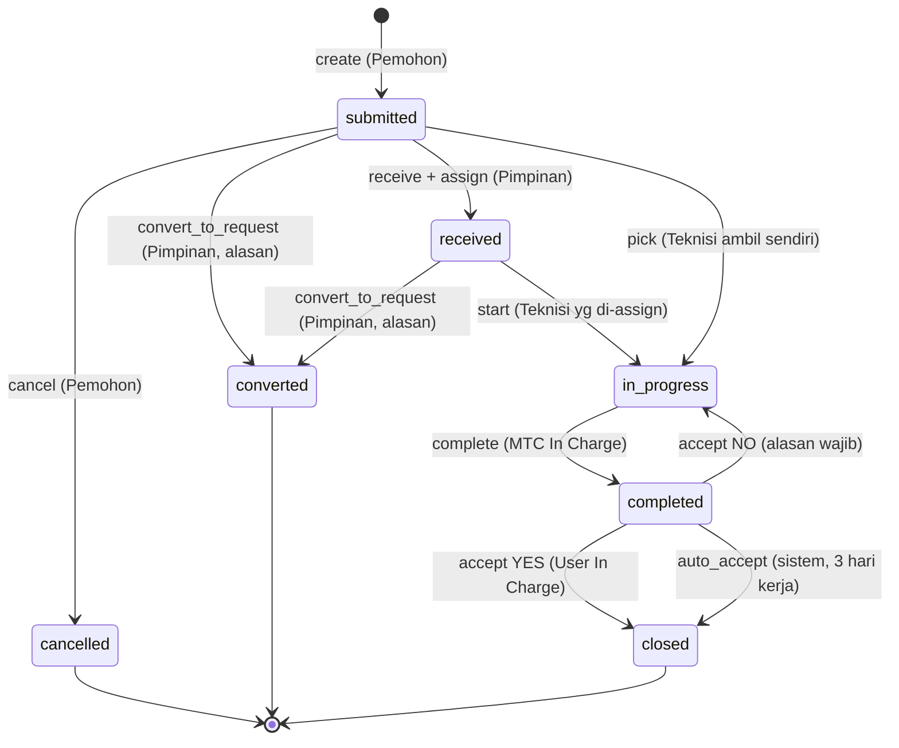
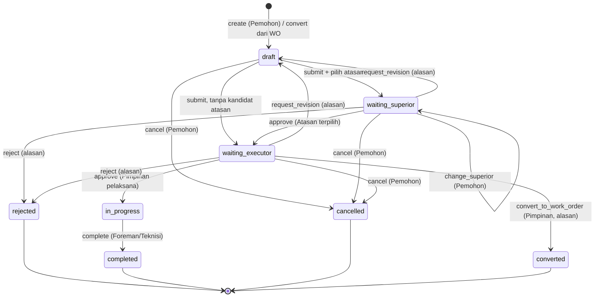
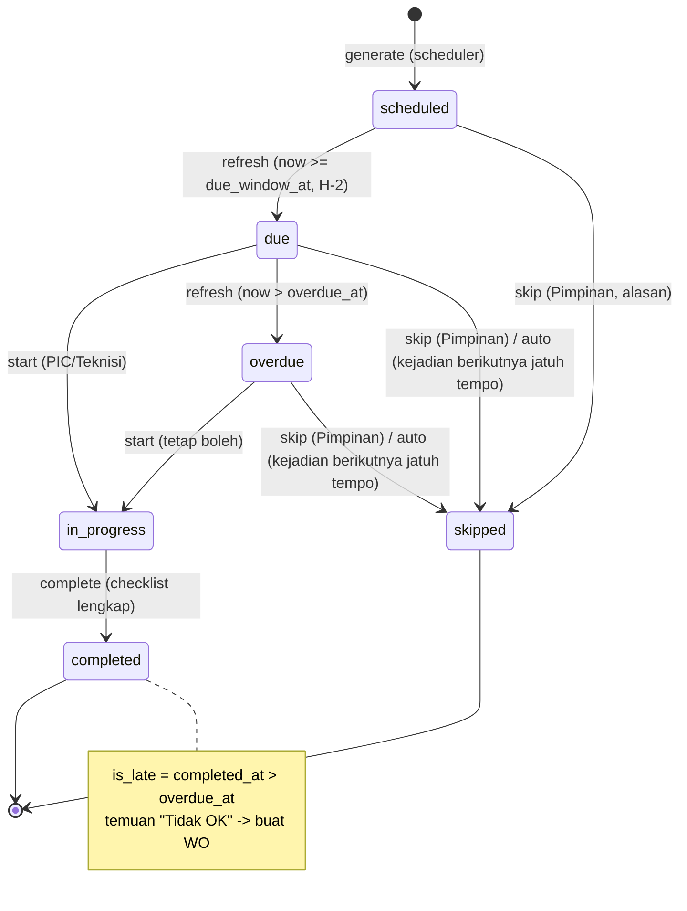

# State Machines — PM-App PT INL

> Status: **DRAFT v0.3** — sudah memasukkan jawaban `docs/OPEN_QUESTIONS.md`.
> Kode status (Inggris) disimpan di DB; label (Indonesia) tampil di UI. Setiap transisi = satu method Service,
> dalam satu transaksi DB: ubah status → tulis `status_logs` → (bila pengesahan) buat `document_signatures` →
> dispatch notifikasi setelah commit. Transisi di luar tabel → `409 Conflict`.
> Istilah `pelaksana`, `pimpinan`, `teknisi`, `seunit`: lihat `docs/API.md`.

## 1. Work Order

| Kode | Label UI |
|---|---|
| `submitted` | DIAJUKAN |
| `received` | DITERIMA (sudah di-assign pimpinan) |
| `in_progress` | DIKERJAKAN |
| `completed` | SELESAI (menunggu penerimaan user) |
| `closed` | CLOSED (DITERIMA_USER tercatat di log, Q-11) |
| `cancelled` | DIBATALKAN |
| `converted` | DIALIHKAN KE FORM REQUEST |

| Dari | Aksi | Ke | Pelaku | Guard / efek |
|---|---|---|---|---|
| — | `create` | submitted | login | pilih seksi pelaksana + kategori seksi tsb; nomor `WO/{kode seksi}/…` (Q-31); 2 baris clearance; QR "Diminta oleh"; notif → semua pelaksana (pool) |
| submitted | `cancel` | cancelled | pemohon | alasan wajib |
| submitted | `pick` | in_progress | pelaksana | jadi assignee lead; `picked_at` = awal SLA (Q-12); QR "Diterima oleh"; notif → pemohon |
| submitted | `receive` | received | pimpinan | ≥1 assignee staf pelaksana; QR "Diterima oleh"; notif → teknisi & pemohon |
| received | `start` | in_progress | assignee | isi `picked_at` bila kosong |
| submitted / received | `convert_to_request` | converted | pimpinan | alasan wajib (mis. "biaya besar, gunakan Form Request"); membuat Form Request `draft` milik pemohon (isi & lampiran disalin, `source_work_order_id`); notif → pemohon |
| in_progress | `complete` | completed | assignee | `work_done` wajib; ≥1 pekerja; clearance MTC terisi; `acceptance_due_at` = +3 hari kerja; QR "Diselesaikan oleh"; notif → pemohon |
| completed | `accept(yes)` | closed | pemohon / atasan pilihannya / seunit (Q-10) | clearance user terisi; QR "Diterima oleh (User)"; log `accepted` + `closed` |
| completed | `auto_accept` | closed | sistem | `now ≥ acceptance_due_at`; `auto_accepted = true`; clearance user ditandai "otomatis" |
| completed | `accept(no)` | in_progress | sama dengan accept | alasan wajib; `rework_count+1`; clearance di-reset; notif → assignee |

## 2. Form Request

| Kode | Label UI |
|---|---|
| `draft` | DRAFT |
| `waiting_superior` | MENUNGGU_ATASAN |
| `waiting_executor` | MENUNGGU_DIVISI (pimpinan pelaksana) |
| `in_progress` | DIPROSES |
| `completed` | SELESAI |
| `rejected` | DITOLAK |
| `cancelled` | DIBATALKAN |
| `converted` | DIALIHKAN KE WORK ORDER |

| Dari | Aksi | Ke | Pelaku | Guard / efek |
|---|---|---|---|---|
| draft | `submit` | waiting_superior | pemohon | `superior_id` wajib, `grade_level` > pemohon (Q-1); snapshot identitas (bagian/sub bagian, HP, status karyawan) & aturan; nomor `REQ{0001}/{kode seksi}/…` terbit di submit pertama (Q-7, Q-31); simpan `preferred_superior_id`; QR "Diminta oleh"; notif → atasan |
| draft | `submit` | waiting_executor | pemohon | hanya bila tidak ada kandidat atasan (grade tertinggi); step superior `skipped` |
| waiting_superior | `change_superior` | (tetap) | pemohon | pengganti delegasi (Q-17); notif → atasan baru |
| waiting_superior | `approve` | waiting_executor | atasan terpilih | QR "Disetujui oleh (Atasan YBS)"; notif → pimpinan pelaksana |
| waiting_executor | `approve` | in_progress | pimpinan | opsional `assigned_executor_id`; QR "Disetujui oleh (Mgr/Spv)"; notif → pemohon & pelaksana |
| waiting_executor | `convert_to_work_order` | converted | pimpinan | alasan wajib (mis. "cukup pakai WO"); membuat WO `submitted` (pemohon sama, `source_service_request_id`); notif → pemohon |
| waiting_* | `reject` | rejected | approver step berjalan | alasan wajib |
| waiting_* | `request_revision` | draft | approver step berjalan | alasan wajib; `revision_no+1`; QR lama `revoked`; approval diulang dari atasan |
| in_progress | `complete` | completed | pelaksana | `executor_notes` wajib; QR "Diselesaikan oleh" |
| draft / waiting_* | `cancel` | cancelled | pemohon | sebelum `in_progress` (Q-9) |

## 3. Tugas PM

| Kode | Label UI |
|---|---|
| `scheduled` | TERJADWAL |
| `due` | JATUH_TEMPO |
| `in_progress` | DIKERJAKAN |
| `completed` | SELESAI (`is_late` menandai terlambat) |
| `overdue` | TERLAMBAT |
| `skipped` | DILEWATI |

Waktu acuan per tugas: `due_at` (tanggal + jam), `due_window_at = due_at − 48 jam` (H-2, Q-13; untuk jadwal per jam
dibatasi maks. setengah interval), `overdue_at = due_at + tolerance_hours`.

| Dari | Aksi | Ke | Pelaku | Guard / efek |
|---|---|---|---|---|
| — | `generate` | scheduled | scheduler (tiap jam) | idempotent (unique schedule+equipment+due_at); butir checklist di-snapshot |
| scheduled | `refresh` | due | scheduler (tiap 15 menit) | notif H-2 ke PIC; notif H-0 saat `due_at` tercapai (`reminder_*_sent_at` mencegah dobel) |
| due | `refresh` | overdue | scheduler | notif → PIC + pimpinan pelaksana; diulang **tiap 2 hari** selama masih overdue (Q-13) |
| due / overdue | `auto_skip` | skipped | scheduler | saat kejadian berikutnya (equipment & jadwal sama) masuk `due`; alasan "Terlewati otomatis oleh jadwal berikutnya"; tugas `in_progress` tidak di-skip |
| due / overdue | `start` | in_progress | PIC / pelaksana | `started_at` |
| in_progress | `complete` | completed | pelaksana | butir wajib & foto wajib terisi; `is_late` dihitung |
| scheduled / due / overdue | `propose_skip` | (tetap) | teknisi | alasan wajib; notif → pimpinan (Q-16) |
| scheduled / due / overdue | `skip` | skipped | pimpinan | alasan wajib |
